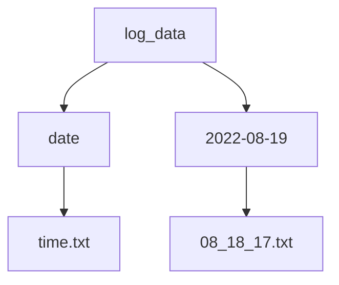

# Whatsapp-messaging-BOT


This Python-based bot has been compiled into an executable file that works on all Windows systems. It enables the user to send bulk Whatsapp messages to recipients without the need to save their phone numbers in their phone.
>Download the Excecutable file [here](https://github.com/akhilrajs/Whatsapp-messaging-BOT/tree/main/installationfile)
## Version : 2.1.5
> ## Updates :
> 1) The program displays a progress bar and sends messages when the time is reached without user-set timers.
> 2) Some bugs fixed from 2.1.4

## Contents :
- [Supports](#supports)
- [Requrements](#requirements)
- [File Structure](#file-structure)
- [log file Structure](#log-file-structure)
- [Contact me](#get-in-touch-with-me)
- [How to use ?](#how-to-setup-message-name-list-and-number-list)
- [Old Version Details](#history)

## Supports
~~~
1) Google Chrome
2) Mozilla Firefox
3) MIcrosoft Edge
~~~
## Requirements 
```python
pip install selenium 4.3.0
pip install webdriver-manager 3.4.2
pip install DateTime 4.3
pip install prettytable 2.1.0
pip install requests 2.28.1
pip install bs4
pip install art 5.8
pip install clear-screen 0.1.14
```
## File structure
The file structure after installation of **Whatsapp Bot.exe** file in installation folder in this repo will be :
| File | Description |
| --- | --- |
| `Whatsapp BOT.exe` | Open this after filling the message, name list and number list |
| `names.txt` | contains the **name** of the **recipients** |
| `numbers.txt` | contains the **whatsapp numbers** of the **recipients** |
| `msg_url.txt` | contains the url of the page containing your message in Github, eg : https://github.com/akhilrajs/Whatsapp-messaging-BOT/blob/main/message.txt |
| `log_data` | contains a log of the program excecution from start to end arranged according to date and time  |
## log file Structure

a sample log_file:
<details><summary>click here to open</summary>
<p>


```[#] time : 22_47_21
[#] reading msg_url file 
[#] downloading message from GITHUB 
[#] message downloaded 
[#] downloading xpaths 
[#] xpath for click_btn created 
[#] downloaded xpath for menu 
[#] printing message 
[#] message : 

this is a test 
 
[#] reading numbers from numbers.txt 
[#] numbers loaded from numbers.txt 
[#] reading names from names.txt 
[#] names loaded from names.txt 
[#] ['akhil']
[#] ['9999999999']
[#] total numbers loaded : 1 
[#] asking user if they want to greet the recipient 
[#] user entered invalid response to y/n question
[#] asking user again for greet
[#] user wants to greet the recipient
[#] greet : Good Evening  
[#] accepting country code 
[#] country code : +91 accepted 
[#] loading options for Google Chrome 
[#] opening Google Chrome 
[#] logging into Whatsapp 
[#] logged in 
[#] sending message to : 9999999999 
[#] message sent to : 9999999999 Akhil 
++
||
++
++
[#] time : 22_48_01
[#] program runtime : 1.33 minutes
[#] END PROGRAM 

```

</p>
</details>

## How to setup message name list and number list
###### Setting up the message:
> 1) Open up a text file in a Github repo
> 2) Type your message and commit changes 
> 3) Copy the link of the file and paste it in the msg_url.txt file . eg : https://github.com/akhilrajs/Whatsapp-messaging-BOT/blob/main/message.txt

###### Setting up the name aand number list :
> 1) Copy the list of names and paste it in the file names.txt
> 2) Copy the list of numbers and paste it in the file numbers.txt

## How to send messages :
> 1) After setting up the above files open Whatsapp BOT.exe 
> 2) if not logged in Log into whatsapp web 
> 3) Sit back and let the program do the rest

## A sample video of the BOT sending a message to me :

> 


## Get in touch with me 
> @ Instagram : [akhil_raj_s_](https://www.instagram.com/akhil_raj_s_/)

> @ Whatsapp : [Akhil Raj S](https://tinyurl.com/akhilrajsWhatsapp)


# History
## Version : 2.1.0
> ## Updates :
> 1) The whatsapp Bot splash screen text changes ASCII art style everytime user opens it 
> 2) Better error handling
> 3) Bot recording start and end time and shows the duration of the program excecution
> 4) Bug fixes regarding the Creation of the log_files

## Version : 2.1.1 
> ## Updates : 
> 1) Allows the user to decide whether they want to greet the recipients  or not 
> 2) Reduced crashing incidences by using loops to avoid invalid arguments by user
> 3) Checks the validity of the country code provided by the user

## Version : 2.1.2
> ## Updates : 
> 1) bug - if user doesnt want to greet the recipent, it  starts the message by user name without Good Moring/Afternoon/Evening 
>    fix - name no longer appears if the user doesnt choose to greet the recipient
```python
if greet_boolean == False :
            name = ""
        else : 
            name = names[idx].title()
msg = greet + name + '''
        
        ''' + str(message) 
```

## Version : 2.1.3
> ## Updates :
> 1) The msg_url.txt file may contain either the message text or the URL of the GitHub page containing the message.

## Version : 2.1.4
> ## Updates :
> 1) The program displays a progress bar and sends messages when the time is reached without user-set timers.
> # Note : The user needs to log in once to save WhatsApp login and doesn’t need to log in again after the timer hits zero.
> this issue will be resolved in version 2.1.5
